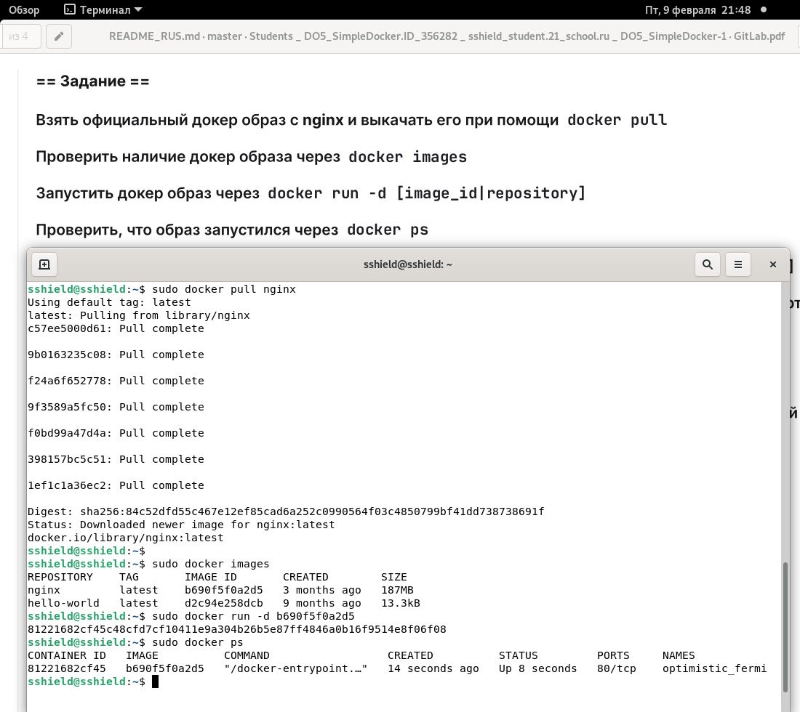
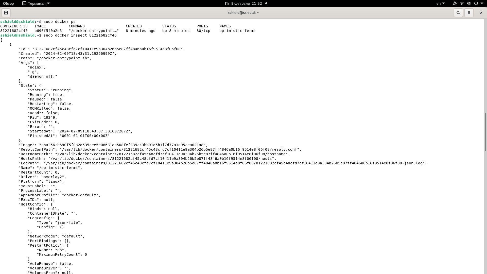
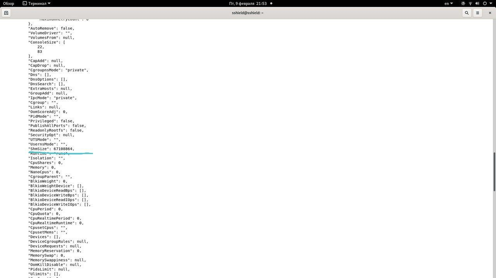
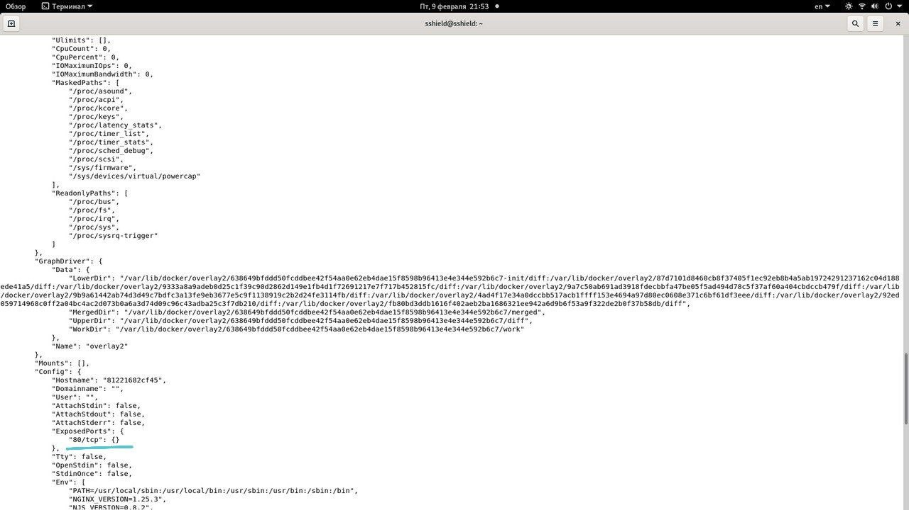
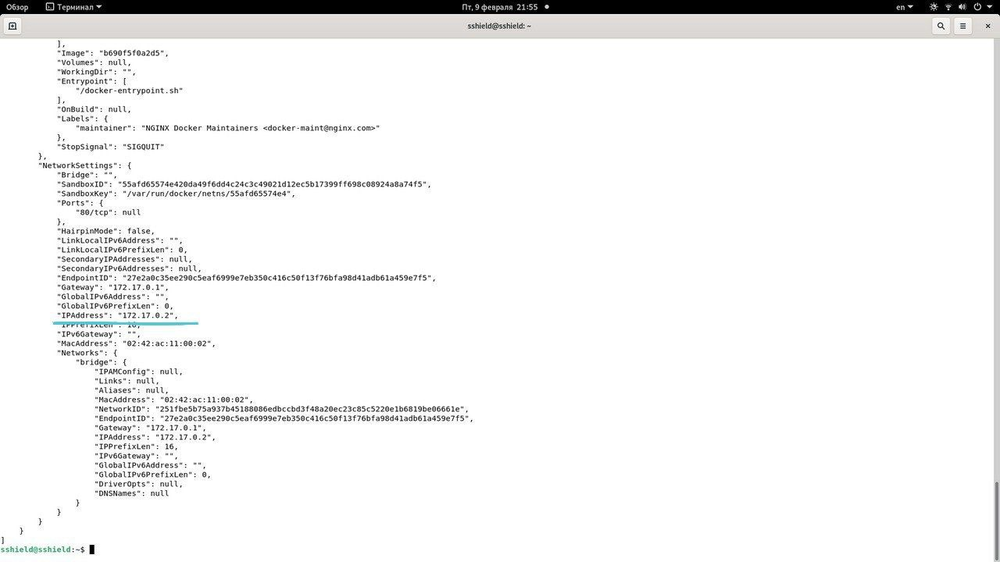
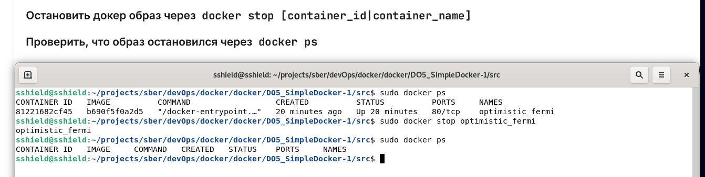
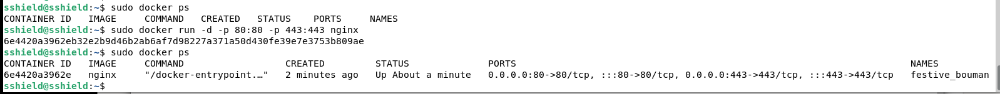
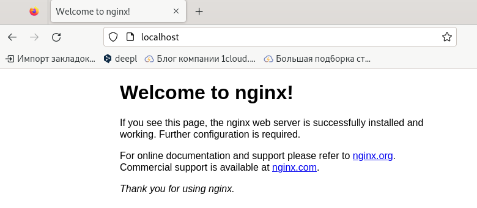
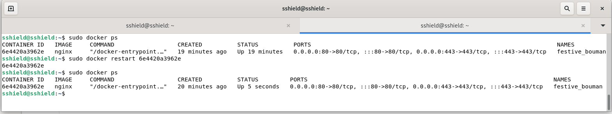

## Part 1
1. Выполнение команд:
- docker pull nginx
- docker images
- docker run -d [imageID]
- docker ps 

2.1 Посмотреть информацию о контейнере командой
- docker inspect [containerID|containerName] :

2.2 По выводу команды определить информацию о:
- размере контейнера:

- Списке замапленных портов:

- ip-контейнера:

2.3 Остановить докер-образ и проверить его остановку:

3.1 Запустить докер с портами 80 и 443 в контейнере, замапленными на такие же порты на локальной машине:

3.2 Проверить браузер по адресу localhost:80

3.3 Перезапустить контейнер командой docker restart [containerID]. Проверить, что контейнер перезапустился:

## Part 2
1. Start

